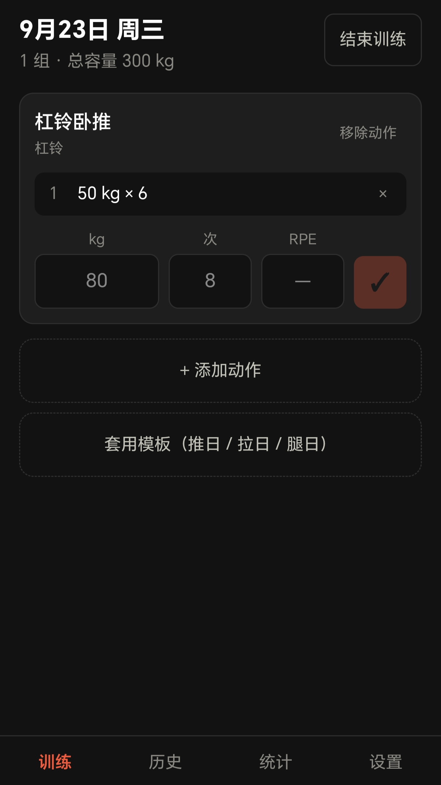
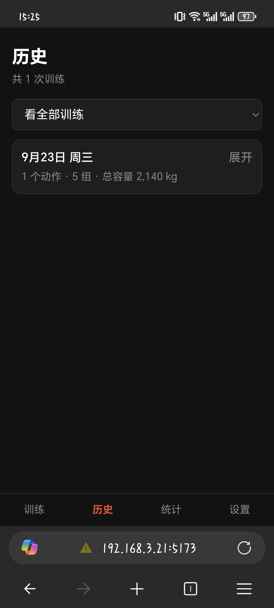
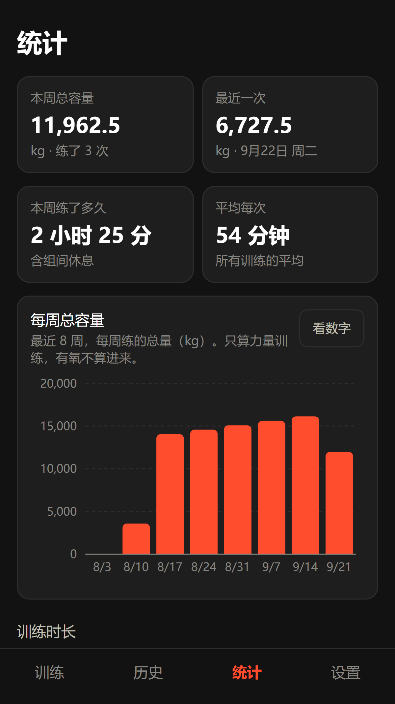

# NanoFIT

一个**完全离线的健身记录本**。两个版本，用哪个都行：

- **安卓 App** —— 手机上装一个 apk，就是个普通的 App
- **网页版** —— 装到手机桌面。（iPhone 只能用这个，苹果不让装外来的 App）

两者功能完全一样，跑的是**同一份代码** —— 不是两个项目。

> ⚠️ **两个版本各存各的数据，互不相通。** 换着用要先在老的那边「导出备份」，再到新的这边「导入恢复」。

**没有账号，没有服务器，不做任何联网请求。** 你的训练数据自始至终只存在你自己手机里，不会上传到任何地方。

---

## 长什么样

三张都是**真机上直接截的**，没有美化。

<p align="center">
  
  <br />
  <em>训练页 —— 填好重量和次数，按那个橙红色的 ✓ 就记下了一组。<br />
  按下去的那一瞬间数据就已经存进手机了，练到一半锁屏、关浏览器都不会丢。</em>
</p>

<p align="center">
  
  <br />
  <em>历史页 —— 按日期倒着排，点「展开」看那天的每一组。<br />
  上面那个下拉框可以只看某一个动作的历史，用来跟自己三个月前的重量对比。</em>
</p>

<p align="center">
  
  <br />
  <em>统计页 —— 每周总容量的柱状图（截这张时只练过一次，所以只有一根柱子）。<br />
  往下还有单个动作的最大重量、总容量、估算 1RM 三条曲线。</em>
</p>

---

## 它能做什么

- **动作库**：163 个商用健身房常见动作（胸 20 / 背 22 / 腿 35 / 肩 19 / 手臂 25 / 核心 20 / 全身 11 / 有氧 11），每个都有一句话动作要领。**可以同时按肌群和器械筛**（比如"胸 + 哑铃"），也能按名字或器械搜；找不到的可以自己加
- **记训练**：选动作 → 记重量、次数、可选的 RPE（自感用力程度）。**每按一次 ✓ 立刻存盘**，练到一半锁屏、关浏览器、手机没电，回来还在。
  加第一个动作时**自动开始计时**，标题旁边一直显示"已练 32 分钟"。
  开始时间可以改（热身那一段也算训练，见下面的「关于训练时长」）
- **组间休息计时器**：默认 90 秒可调，结束有三声提示音。
  **安卓 App 上到点还会发系统通知** —— 切到微信、锁屏了也一样叫得醒你
  （第一次用会问你要通知权限）
- **有氧记录**：跑步机、椭圆机、划船机、动感单车、户外跑、跳绳等 11 种。只填时长就行，距离可选。**没量距离可以填配速**（打 `5:30` 或 `5.5` 都认），距离自动算出来。户外跑还有**操场模式**——选第几道、跑了几圈，按田径场规则算距离（第 1 道 400 米，每往外一道 +7 米）
- **历史记录**：按日期倒序，可以只看某个动作的历史（对比自己三个月前的重量）。
  每一条都写着"练了多久 · 用的哪一档强度 · 约多少千卡"，方便核对
- **统计图表**：每周总容量、每周练了多久、每次训练时长的趋势（按天）、单个动作的最大重量 / 总容量 / 估算 1RM 趋势、有氧时长与单次距离、体重体脂变化
- **估算 1RM 那条曲线**看的是"**我最近大概能举多少**"，不是"当天最好那一组"——
  当天最好的数只会跟着练法上下跳，看不出进步。所以它画的是"截至那天、往前 90 天里的最好水平"，
  另外配一条只升不降的虚线标出历史最高。**只统计 12 次以内的组**：次数多了 Epley 公式会明显高估
- **消耗热量（估算）**：每次训练大致消耗多少。力量按你选的强度档位算，有氧按动作和速度算，两者分开显示。**这只是估算**，界面上写清楚了依据和误差，详见下面的说明
- **训练模板**：内置"推日 / 拉日 / 腿日"，一键套用；也能自己建
- **身体数据**：身高、体重、体脂。**没有体脂秤也能看**——填一次性别和出生年份，App 就按身高体重自动估一个体脂率；它和你自己称出来的分开标记（`≈18.4% 估算` / `21% 实测`），绝不混在一起
- **导出 / 导入**：整份数据导出成一个 JSON 文件。**手机上**点导出会弹出系统的分享面板，
  你选「保存到文件」或者发到微信收藏 —— 选完了才算真存下来
- **日间 / 夜间**：设置里点一下切换。日间是白底，夜间是原来的深色；选了记得住，下次打开还是它

---

## 关于"训练时长"

时长在热量公式里是个**乘数** —— 少记一半，热量就少一半。所以它怎么算的值得说清楚。

### 什么时候开始、什么时候结束

- **开始**：你**加第一个动作**那一刻自动开始，不需要点任何"开始"按钮。
  （手动点的问题是**会忘**，一忘就是整场没计时；自动记最多差十几分钟，而且随时能改。）
- **结束**：你点「结束训练」那一刻。所以它**包含组间休息** ——
  热量用的强度档位是按整场平均定的，只算做组时间会严重高估。
- 练的过程中，标题旁边一直有个"已练 32 分钟"在实时走。

### 热身那一段算不算？—— 算，所以要你自己补

热身也是训练的一部分（热量公式要的就是这段时间的活动强度）。
但 App 猜不到你几点开始热身，它只知道你几点掏的手机。

**所以：结束时能改。** 点「结束训练」弹出的面板里有这么一行：

```
本次训练 42 分钟
开始于 14:00 · 热身了多久？点这里往回改
```

点开有「提前 10 / 20 / 30 分钟 / 1 小时」几个快捷键，也能直接填一个时间。
你热身了多久心里有数，往前推多少就行。

> 手填的时间只改"几点几分"，**日期不变** —— 跨天的歧义说不清楚，
> 而热身要补的本来也就是几十分钟。

### 忘了点「结束训练」怎么办

这是最实际的问题：练完直接走了，第二天才打开 App。

**不会**记成十几个小时。规则是：**从开始到现在超过 6 小时**，
就认为你是忘了点结束，这时候**结束时刻按你最后一组的时间算**，而不是"现在"。

- 为什么不干脆设个"最长 6 小时"的硬上限：那样等于把多出来的时间**编掉**，
  而"你最后一组记到几点"是你自己记的，有据可查。
- 顺带的好处：**"昨晚练到 00:30"这种真实情况不会被误伤** ——
  最后一组就在 00:20，算出来照样是对的。
- 训练页顶部会出一条横幅把这件事说清楚，并给你两个按钮：
  「结束这次训练」和「丢弃」。

### 去哪儿看

| 在哪 | 看到什么 |
|---|---|
| 训练页 | 标题旁边"已练 32 分钟"，实时走 |
| 历史页 | 每条记录下面那行："42 分钟 · 高强度 6.0 · 约 280 千卡" |
| 统计页 | 「本周练了多久」「平均每次」两个卡片；下面「训练时长」一节是按天的趋势图 |

> 趋势图是**按天合并**的：一天练两次算那天的总时长。想知道那天是几次，
> 点右上角「看数字」，表里有一列写着。

**老记录**（2026-09-24 之前记的）没有时长数据：该显示时长的地方**整项不出现**，
不报错、也不拿 0 顶替。（只有统计页「平均每次」那个卡片例外 ——
一次都算不出来时它会显示一个"—"。）

---

## 关于"消耗热量"这个数字（**请读完再用**）

**它是估算，不是测量。** 身体消耗多少热量，除了戴呼吸面罩进实验室，没有别的办法测准 ——
手环、跑步机屏幕上显示的卡路里，同样也是估算，同样不准，而且各家算法都不一样。
所以**这里的数字和手环对不上是正常的，不是谁坏了**。

### 怎么算的

```
消耗（千卡） =（MET − 1）× 体重(kg) × 时长(小时)
```

**MET** 是"这段时间身体在使劲的倍数"，取值来自 Compendium
（国际通用的运动能量消耗表，拿真人实测出来的）。

**为什么要减那个 1**：MET 里已经含了"躺着不动也要烧的那部分"（基础代谢）。
减掉它，算出来的才是**这次运动额外多消耗的**。所以它天生比手环上那个数小 ——
手环给的常常是**总消耗**。这一点界面上也写着。

### 力量和有氧分开算

| | 怎么定 | 值 |
|---|---|---|
| **力量训练** | 你结束训练时自己选一档，App 会先按数据推荐一个 | 低强度 3.0 / 中等 3.5 / 高强度 6.0 / 循环训练 8.0 |
| **有氧** | 按动作类型，跑步另外按速度 | 椭圆机 5.0、骑行 7.0、划船机 7.0、爬楼机 9.0、跳绳 12.0…… |

推荐那一档的依据，**首选是你自己记的 RPE** —— 那是你亲口说的"这一组有多难"，
比什么推测都准。大致是：RPE 8 以上算高强度、6–7 中等、不到 6 低强度；
如果 RPE 很高、每组之间又隔得很短，那就是循环训练。
**没记 RPE 的时候**才退回按数据猜：每组之间隔多久、有没有练深蹲/硬拉/推胸这类
多关节大重量动作（杠铃和固定器械都算）、整场时长和组数。

面板上会明说"系统建议哪一档、依据是什么"。**默认就选中它**，你觉得不对随时能改 ——
改完之后，面板上会提示"你选的和系统建议的不一样，热量会按你选的算"。
上次选过的那一档会做成一个「沿用上次」按钮，**要你自己点，它不会自动替你选**。

### 误差大概多少

**±10–20%。** 这是个"知道大概练了多少"的数，不是能拿来精确对比昨天的数。
界面上永远写"**约** 520 千卡"，不写"消耗 523 千卡"——那多出来的 3 千卡是假的精确感。
（同一个页面上所有地方都是这个精度，不会有"卡片说约 110、表里写 113"这种事。）

### 数字不对？点「这些数是怎么算出来的？」

统计页热量那一节有一个可展开的按钮，点开会**逐次列出本周每一次训练**
用到的每一样输入：

```
用到的数据
  体重 80 kg（来自「身体数据」里最近一次）
  公式 消耗 =（MET − 1）× 体重(kg) × 时长(小时)
  减 1 是为了只算"运动额外多消耗的"，不含躺着也要烧的基础代谢

本周的每一次训练
  9月24日 周四
  低强度 3.0 · 整场 42 分钟
  力量 （3 − 1）× 80 kg × 0.70 小时 ≈ 110 千卡
```

历史记录里每一条也会显示"时长 · 档位 · 约多少千卡"。
**数字看着不对时，对着这两处一比就知道是哪里不对了** —— 是档位选错了、
时长记错了，还是体重不准。不用再自己反推。

### 几个会被算错的情况

- **忘了点"结束训练"**：时长会一直涨，热量跟着涨。这个数按实际时长算，不封顶。
- **一次训练里既有力量又有跑步**：力量那部分会先减掉跑步的时长，不会算两遍。
- **老记录**（2026-09-24 之前记的）：那时还没开始记训练时长，算不出热量，界面上会**不显示这一项**。
- **没填距离也没填配速的跑步**：按"慢跑 8 km/h"估，会偏低或偏高。

---

## ⚠️ 请先读这一段：数据安全

这个 App **没有云端备份**（这是设计如此，不是缺陷）。这意味着：

> **换一台手机，你的全部训练记录就没了。**

两个版本各自怕什么：

| 版本 | 什么情况下会丢 |
|---|---|
| **安卓 App** | 基本不会。但「设置 → 应用 → NanoFIT → 存储 → **清除数据**」会清空，**别点** |
| **网页版** | **清一次浏览器缓存就没了** |

所以**用网页版的话，务必**做这两件事：

1. **把它"添加到主屏幕"**（iPhone 用 Safari、安卓用 Chrome，菜单里都有这一项）。
   装成 App 之后，iPhone 有一条"7 天没打开就清掉网站数据"的规矩**不适用**于它；不装的话，隔一周没练就真可能被清空。
2. **每周导出一次备份**：设置 → 导出备份。
   - **手机 App**：会弹出系统的分享面板，选「保存到文件」或者「微信 → 收藏」。
     ⚠️ **面板弹出来 ≠ 存好了** —— 你得真的选一个去处。点了取消就是没存。
   - **网页版**：文件直接进浏览器的「下载」文件夹。
   - 导完顺手确认一下文件真的在（微信收藏里能看到、或者在「文件」里搜 `nanofit-`）。

**换手机（或者从网页版换到 App）怎么搬数据**：老的那边「导出备份」→ 把 json 文件传过去 → 新的那边「导入恢复」。

---

## 本地跑起来

需要电脑上装有 [Node.js](https://nodejs.org/)（20.19 以上版本）。

```bash
npm install      # 第一次跑之前执行一次，下载依赖
npm run dev      # 启动开发服务器
```

然后打开终端里显示的 `http://localhost:5173`。

**想用手机试**：

```bash
npm run dev -- --host
```

手机连**同一个 WiFi**，浏览器打开终端里显示的那个 `http://192.168.x.x:5173` 地址。
（注意：手机上不能用 `localhost`，那个地址指的是手机自己。）

---

## 打包和部署

```bash
npm run build    # 打包，产物在 dist/ 目录
npm run preview  # 本地预览打包后的效果
```

打包产物是一堆纯静态文件，**任何静态网站托管都能放**。部署到 GitHub Pages 的话：

1. 把代码推到 GitHub 仓库
2. 仓库的 Settings → Pages → Source 选 `Deploy from a branch`，分支选 `main`、目录选 `/root`
3. 等一两分钟，访问 `https://你的用户名.github.io/仓库名/`

> 项目里 `vite.config.ts` 已经把 `base` 设成了 `'./'`（相对路径），所以放在带子目录的地址下（比如 `/nanofit/`）也能正常工作，不用改配置。

---

## 📱 安卓 App（Capacitor 套壳）

安卓版是用 **Capacitor**（读"卡帕西特"）套的壳 —— 它的做法是把网页版**原样装进**一个安卓 App 里。所以两边功能天然一样，也不用维护两套代码。

```bash
npm run build          # 先打包网页
npx cap sync android   # 再把网页产物和插件同步进安卓工程
```

改完代码要更新到安卓，就是这两句。**注意 `npm run dev` 不会影响安卓** —— 它动的是开发服务器，安卓读的是 `dist/`。

### 怎么打包 APK

环境已经配好了（2026-09-23）。打包就一句话：

```bash
cd android
./gradlew assembleDebug
```

产物在 `android/app/build/outputs/apk/debug/app-debug.apk`，大约 8.5 MB。
第一次跑要 2 分钟左右，之后改代码再打会快很多。

> ✅ **当前状态**：包已经打出来了，2026-09-23 在真机上装好，确认可正常使用。
> 为了好找，另外复制了一份到仓库外面：`E:\Vibe Coding\Nanofit\安卓安装包\NanoFIT.apk`

> ⚠️ **debug 版只能自己装着玩，不能上架** —— 它带 `debug` 标记、用的是临时签名。

> ⚠️⚠️ **永远不要卸载重装。**
> 训练数据只存在这一台手机里，**卸载 = 全没了**。
>
> 好消息是**根本不需要卸载**：同一个签名打的包，安卓会直接盖掉旧的，
> 数据原地不动。而签名是这台电脑上的一把"调试钥匙"自动盖的
> （`C:\Users\Administrator\.android\debug.keystore`，
> **它不跟着仓库走**）—— 只要还是这台电脑打包，签名就必然一致。
>
> ★★ **换一台电脑打包 = 签名变了 = 新版根本装不上**
> （报错大概是"应用未安装"，不说明原因），那时只能先卸载再装 ——
> 而那一步数据就没了。
> 所以：**换电脑之前，先导一份备份。** 任何"要不卸载试试"的念头出现之前，也一样。
>
> 打包后想确认签名对不对，两边各跑一句，SHA-256 指纹一模一样就没问题：
>
> ```bash
> # 新包的签名（apksigner 在安卓 SDK 的 build-tools 目录里）
> apksigner verify --print-certs 新包.apk
> # 这台电脑那把钥匙的指纹（keytool 在 JDK 的 bin 目录里）
> keytool -list -v -keystore "C:\Users\Administrator\.android\debug.keystore" -storepass android
> ```

### 版本号怎么编（2026-09-24 定的）

打出来的 App 身上带着两个"版本"，作用完全不同，**两个都写在
`android/app/build.gradle` 里**：

| 名字 | 是个什么东西 | 谁能看见 |
|---|---|---|
| `versionCode` | 一个纯数字。安卓拿它比大小，判断手机上装的那个是不是旧了 | **只有安卓系统**，你永远看不到 |
| `versionName` | 一段文字 | **你眼睛看**（设置 → 应用 → NanoFIT） |

本项目这样编：

```groovy
versionCode 20260924                        // 打包那天的日期
versionName "2026.09.24 · 18d4d1a"          // 日期 · 存档号
```

- **日期**保证它永远比上一个包大 → 安卓一定认得出"这是新的"；
- **存档号**就是 git 那串 7 位编号（见「存档」一节），看到它就等于看到"这个包里
  有哪些改动"，可以直接倒查；
- 所以打包时**不用记任何东西**，只要把这两行改成当天日期 + 当前存档号。

App 的**设置页最下面**会把这串版本号显示出来。它读的是**手机里那个包本身**
（通过 Capacitor 的 `App.getInfo()`，取的是安卓系统记的 `versionName`），
不是代码里写死的字符串 —— 所以不可能出现"界面上写新的、装的却是旧的"。

> ⚠️ **`versionCode` 只能往大改，绝不能往小改。**
> 往小改，安卓会当场拒绝安装，只在屏幕上留一句"应用未安装"，不告诉你为什么。
>
> 同一天打第二个包，日期一样、号一样，**没关系** —— 安卓允许同号覆盖安装。
> （要区分同一天的两个包，看 `versionName` 里的存档号。）

#### 打这个包踩过的三个坑（换电脑或换项目位置时会再遇到）

**1. Java 必须用 21 左右，不能用 Android Studio 自带的那个**

Android Studio 自带的 JBR 是 **Java 25**，而打包工具 Gradle 8.14.3 只认到 Java 24，
会报这个错：

```
Unsupported class file major version 69
```

（69 就是 Java 25 的类文件版本号。）

解决：单独装了 Microsoft OpenJDK 21，并在**用户目录**的
`C:\Users\Administrator\.gradle\gradle.properties` 里指定：

```
org.gradle.java.home=C:/Program Files/Microsoft/jdk-21.0.12.101-hotspot
```

注意那个文件**不属于本仓库** —— 它是"这台电脑"的配置，不会跟着项目走。

**2. 项目路径不能有中文**

本项目在 `E:\Vibe Coding\Nanofit\Nanofit工程`，"工程"两个字会让安卓构建工具
**直接拒绝干活**（`Your project path contains non-ASCII characters`）。

解决：`android/gradle.properties` 里加了一行跳过这道检查：

```
android.overridePathCheck=true
```

> ★ **如果以后打包报出莫名其妙的错，第一个就怀疑这里。**
> 实在不行就把整个项目挪到纯英文路径（比如 `E:\nanofit`）再试。

**3. Gradle 第一次下载自己要挂代理**

它的下载地址会重定向到 **GitHub**（`release-assets.githubusercontent.com`），
国内直连必然超时。第一次跑的时候加代理即可：

```bash
GRADLE_OPTS="-Dhttps.proxyHost=127.0.0.1 -Dhttps.proxyPort=7897" ./gradlew assembleDebug
```

**只影响第一次** —— Gradle 下完之后缓存在本机了。之后下安卓依赖库
（dl.google.com、Maven Central）都直连能下，不需要代理。

### 以后要上架，怎么打 release 版

release 版要做三件事，**现在不用管**，到时候我带你做：

1. **生成签名密钥**（App 的"公章"，一辈子就这一个，**丢了就再也无法更新这个 App**）：
   ```bash
   keytool -genkey -v -keystore nanofit-release.jks -alias nanofit \
     -keyalg RSA -keysize 2048 -validity 10000
   ```
   ⚠️ 生成后**立刻备份到网盘和微信收藏，并记住密码**。
   `.jks` 后缀已经在 `.gitignore` 里，不会被提交进仓库（泄露了别人就能冒充你发更新）。
2. **在 `android/app/build.gradle` 里配置签名**（告诉它用哪个密钥、密码是什么）
3. **打包**：
   - 上架 Google Play → `./gradlew bundleRelease`（产出 `.aab` 格式，商店要这个）
   - 自己分发 → `./gradlew assembleRelease`（产出 `.apk`）

### 安卓端和网页版不一样的地方

| 地方 | 网页版 | 安卓端 |
|---|---|---|
| 数据存哪 | 浏览器 localStorage | 原生 SharedPreferences（`/data/data/<包名>/shared_prefs/`） |
| 导出备份 | 浏览器直接下载到「下载」文件夹 | **弹系统分享面板**，你自己选存到哪 |
| 组间休息提醒 | 只能你盯着屏幕时响，切走就不响了 | **切 App、锁屏到点也会响**（系统级通知） |
| 屏幕常亮 | 浏览器 Wake Lock（**必须 https 才生效**） | 原生 KeepAwake 插件 |
| 震动 | `navigator.vibrate`（iPhone 不支持） | 原生 Haptics 插件，力度可调 |
| 地址栏／状态栏颜色 | `theme-color` 那个 meta | `@capacitor/status-bar` 插件 |
| 物理返回键 | 没有这个概念 | 分层返回（见下） |
| Service Worker | **要**，离线能力全靠它 | **不要**，见下 |

分流全靠 `Capacitor.isNativePlatform()`。**浏览器里它永远是 false**，所以网页版走的还是老路，一点没变。

### 物理返回键（返回栈）

`src/lib/backbutton.ts` 是个很小的"返回栈"。按返回键时，从**最后登记的**往前问：

1. 在「设置」的子页面（动作库／模板／身体数据）→ 退回设置列表
2. 训练进行中 → 弹窗确认（记录其实已经存好了，只是别让人手滑退出去吓一跳）
3. 不在训练页 → 切回训练页
4. 已经在训练页 → 退出 App

> ⚠️ **改的时候注意**：`App.tsx` 里那个监听**必须只挂一次**（依赖数组留空），当前在哪个 tab 用 ref 现读。
> 如果改成依赖 `[tab]`，每次切 tab 都会重新挂监听，而返回栈的规矩是**后登记的优先** ——
> App 的处理器会爬到设置页上面，结果在身体数据页按返回时会直接跳到训练页，把设置列表那层跳过去。

### 为什么原生壳里不要 Service Worker

Service Worker 的拿手好戏是"断网也能打开"，靠的是把文件存进浏览器缓存。
但安卓 App 的网页文件本来就打包在 App 内部，**断网照样能打开**，离线是白送的。

而它在原生壳里反而会帮倒忙：

- 它是"缓存优先"的 —— 你改了代码重新打包安装，它还把旧文件端出来，
  结果就是"我明明重装了 App，界面还是老样子"，这种问题极难查
- 原生壳里的缓存和网页版的互不相干，多这一层只是多一个出错的地方

所以原生壳里直接跳过注册。**网页版的注册一个字没动** —— GitHub Pages 上的离线能力照旧。

### 安卓图标怎么改

源图只有一个：`public/favicon.svg`。改完之后跑两步：

```bash
node gen-android-icons.mjs   # 生成 5 张源图到 assets/
npx capacitor-assets generate --android \
  --iconBackgroundColor '#121212' --iconBackgroundColorDark '#121212' \
  --splashBackgroundColor '#121212' --splashBackgroundColorDark '#121212'
```

> ⚠️ **前景层不能随便放大**。安卓自适应图标的"安全区"是画布正中间的一个**圆**，
> 所以判断标准跟"图形有多宽"**无关**，要看**离中心最远的那个笔画有多远**（要 ≤ 50%）。
> 完整推导写在 `gen-android-icons.mjs` 里 `FOREGROUND_SCALE` 那个常量的注释里 —— 改之前先读它。

---

## 🔧 出问题了怎么办（急救三步）

### 1.（网页版）界面看着不对，或者"我改了代码但打开还是老样子"

> **安卓 App 不会有这个问题** —— 它压根不用 Service Worker，原因见上面的「📱 安卓 App」一节。
> 安卓 App 更新界面要重打包装一遍，不会出现"装了新的还是旧的"。

这是 **Service Worker（负责离线的小工人）把旧版本缓存住了**。按顺序试：

- **手机上**：浏览器设置 → 找到这个网站 → 清除网站数据。（⚠️ 先确认你的数据已经导出备份过！）
- **电脑上**：按 `F12` → `Application` 面板 → 左边 `Service Workers` → 点 `Unregister`；再到 `Storage` → 点 `Clear site data`

如果这招反复出现，把 `public/sw.js` 里那一行 `const CACHE_VERSION = 'nanofit-v2'` 改成**下一个数**（现在是 `v2`，就改成 `'nanofit-v3'`），重新部署一次 —— 新工人上任时会把旧仓库整个删掉。

### 2. 数据好像不见了

**先别清缓存、先别做任何操作。**

打开 设置 → 点"导出备份"。**如果文件导出来了并且里面有内容，数据就还在**，只是某个页面显示出了问题，把现象告诉开发者即可。

> ⚠️ **手机上导出会弹分享面板，必须选一个去处（保存到文件 / 微信收藏）才算存下来。**
> 点了取消 = 没存。导完最好去确认一眼文件真的在。

### 3.（网页版）装到手机桌面后打不开 / 图标不对

- 确认是通过 `https://` 访问的（本地的 `http://192.168.x.x` 装不成 PWA，浏览器不允许）
- iPhone 上必须用 **Safari** 打开才能"添加到主屏幕"，Chrome 不行

---

## 开发说明

### 技术栈

Vite + React + TypeScript + Tailwind CSS v4 + recharts。
没有后端、没有数据库、没有登录。状态管理只用 `useState`，**没有引入路由库** —— 四个页面靠一个变量切换。数据全部存在手机本地（网页版用 `localStorage`，安卓版用原生存储，两边都由 `src/lib/storage.ts` 统一管）。

### 目录结构

```
src/
  types.ts              所有数据的"形状"定义（改数据结构只改这一个文件）
  data/
    exercises.ts        163 个预置动作（8 个肌群）
    templates.ts        3 个预置模板
  lib/
    storage.ts          ★ 唯一碰存储的地方（网页版 localStorage / 安卓端 preferences）
    date.ts             本地日期处理（避开时区坑）
    calc.ts             容量、1RM 等公式
    kcal.ts             热量估算 + 强度档位推荐（全项目只有这一份算法）
    stats.ts            把训练记录汇总成图表数据
    json.ts             导出 / 导入备份（只管内容，不管文件怎么落地）
    savefile.ts         把一段文字变成文件、交给用户存（手机上走系统分享面板）
    restnotify.ts       组间休息的后台提醒（跟系统预约闹钟）
    beep.ts             提示音合成
    wakelock.ts         休息期间保持屏幕常亮
    backbutton.ts       安卓物理返回键的返回栈
    theme.ts            日间 / 夜间配色 + 状态栏
    id.ts               生成不重复编号
  components/           可复用的小零件
  screens/              整页的界面
CLAUDE.md               本项目的开发约定
PLAN.md                 施工图（功能、数据模型、阶段划分）
```

### 几处"看起来奇怪但故意这么写"的地方

改代码前建议先看一眼，以免"优化"掉它们：

| 位置 | 为什么这么写 |
|---|---|
| `lib/date.ts` | **不能**用 `toISOString()` 取日期。它给的是格林威治时间，北京时间**凌晨 0 点到 8 点**之间会得到"昨天"，晨练记录会记错日子 |
| `lib/id.ts` | `crypto.randomUUID()` 在手机用局域网地址（`http://192.168.x.x`）访问时是 `undefined`，必须降级 |
| `lib/beep.ts` | 从后台切回前台时，`AudioContext` 是挂起状态，`resume()` 是**异步**的 —— 不等它完成就播放，声音会被丢掉 |
| `components/RestTimer.tsx` | 只存"休息到几点结束"，**不存**"还剩几秒"。手机后台会把定时器降频到一分钟一次，按秒递减的写法会走不准 |
| `components/ChartCard.tsx` | 图表外面那层 `div` 的**固定高度不能删**。recharts 靠它算高度，没有高度会画出一片空白且不报错 |
| `screens/TrainScreen.tsx` | "结束训练"必须**先确认存进历史成功**再清空"正在进行"，顺序反了会在存储满时丢掉整次训练 |
| `screens/StatsScreen.tsx` | 一张图只画一个指标，**不做双纵轴**（重量和容量数值差上百倍，画在一起会互相压平） |
| `lib/calc.ts` 的体脂公式 | 算的是"这个身高体重年龄性别的**人群平均**"，误差有 ±4～5 个百分点，**肌肉多的人会被算高**。所以界面上永远标着"估算"，绝不假装是称出来的 |
| `screens/BodyScreen.tsx` 保存时"补齐不替换" | 同一天再存一次，只覆盖你这次填了的格子。整条替换的话，先记体重、再补记身高时会把体重弄丢 |
| `screens/LibraryScreen.tsx` 器械条上的"其他"按钮 | 它只在**存在非标准器械的自建动作**时才出现。老版本允许自由填器械，删掉这个兜底的话，那些动作在任何器械按钮下都点不出来，看着像数据丢了 |
| `src/index.css` 的颜色变量 | 全站颜色只在 `@theme` 里定义一次，日间那套在 `:root[data-theme='light']` 里整套覆盖。**不要**改成给单个元素写两遍（`bg-white dark:bg-[#121212]`）—— 几百处里漏一处，日间模式下就是白底白字 |
| `screens/StatsScreen.tsx` 的 `chartColors()` | recharts 要的是实际色值，不认 `bg-brand` 这种类名。写死十六进制的话，切到日间模式线还是深色那套，白底上几乎看不见 |
| `lib/theme.ts` 的 `applyTheme()` | 它顺手改 `<meta name="theme-color">`。不改的话，日间模式页面是白的、手机顶上却压着一条黑边 |
| `index.html` 里那段小脚本 | 必须在样式表之前跑。删掉它，夜间模式每次打开会先闪一下白光 |
| `public/sw.js` 的缓存版本号 | 改了 favicon.svg、icons/、manifest 这些**文件名不变**的文件，必须把 `CACHE_VERSION` 升一位，否则手机上永远是旧的 |
| `public/manifest.webmanifest` 的 `background_color` | 写死是深色。它是**启动开屏那一下**的颜色，改不了（清单文件是静态的，跟不上主题切换）。所以日间模式下点开 App 会先闪一下深色再变白 —— 已知的小瑕疵，不影响使用 |
| `lib/theme.ts` 改 iPhone 状态栏那一段 | 没法在电脑上验证，需要真 iPhone 装成 PWA 才看得出。安卓不看这个 meta |
| `main.tsx` | Service Worker **只在网页版正式打包后注册**，安卓原生壳里跳过（原因见上面「为什么原生壳里不要 Service Worker」）。开发时也注册的话，改了代码浏览器会一直显示旧版本 |

### 代码推不上去怎么办（国内网络的常态）

`git push` 报 `Connection was reset` 或者 `Could not connect to server`，八成不是你的错，是 `github.com` 被卡了。先判断是哪个域名不通：

```bash
curl -s -o /dev/null -w "%{http_code}\n" -m 8 https://github.com      # 000 = 不通
curl -s -o /dev/null -w "%{http_code}\n" -m 8 https://api.github.com  # 200 = 通
```

**只要 `api.github.com` 通、`github.com` 不通**，就是典型的域名级封锁。本项目已经配好了走代理（写在 `.git/config` 里，**只影响这一个项目**，不动你的全局设置）：

```bash
git config --local http.proxy http://127.0.0.1:7897   # 这台机器上的 Clash Verge 监听这个端口
git config --local --unset http.proxy                 # 想去掉就执行这句
```

> ⚠️ **代理软件没开着的时候，`git push` 同样会失败**（会提示连不上 7897）。
> 要么把代理开起来，要么执行上面那句 `--unset`。

**另一条路：SSH。** 走 22 端口，实测**不开代理也能连**，比 HTTPS 稳。本机已经生成好密钥了（`~/.ssh/id_ed25519`），只差登记到 GitHub：

1. 打开 https://github.com/settings/ssh/new ，把 `~/.ssh/id_ed25519.pub` 的**整行内容**粘进去
2. `git remote set-url origin git@github.com:7Nanometer/nanofit.git`

---

### 图标怎么改

图标源文件是 `public/favicon.svg`，改完执行：

```bash
npm install --no-save sharp   # 转换工具，只在生成图标时需要
node gen-icons.mjs            # 生成各种尺寸的 PNG
```

---

## 常用命令

| 命令 | 作用 |
|---|---|
| `npm run dev` | 启动开发服务器 |
| `npm run dev -- --host` | 启动并允许手机通过局域网访问 |
| `npm run build` | 打包（会先做 TypeScript 类型检查） |
| `npm run preview` | 本地预览打包结果 |
| `npm run lint` | 代码检查 |
