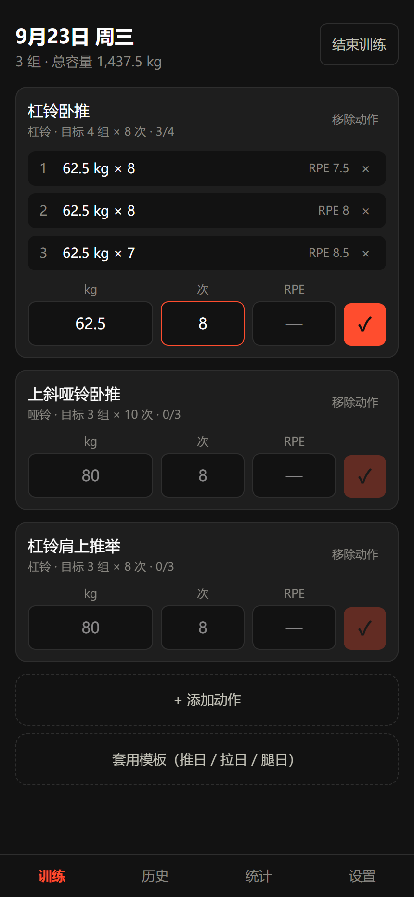
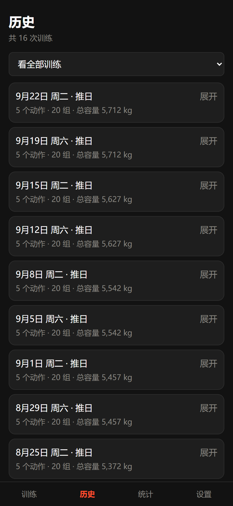
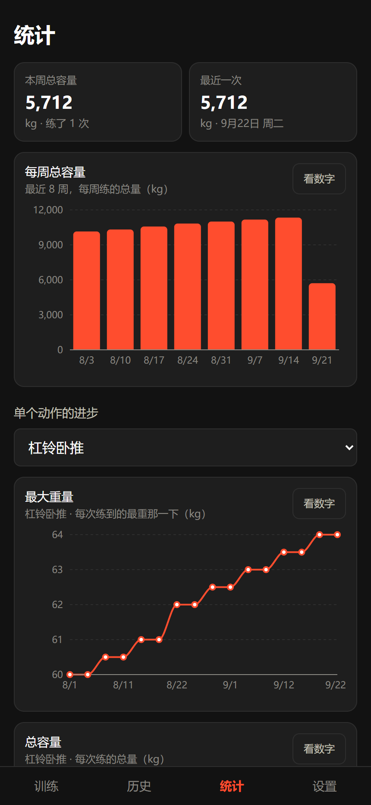

# NanoFIT

一个**完全离线的健身记录本**。装到手机桌面上，用起来和真 App 一样。

**没有账号，没有服务器，不做任何联网请求。** 你的训练数据自始至终只存在你自己手机的浏览器里，不会上传到任何地方。

<p align="center">
  
  
  
</p>

---

## 它能做什么

- **动作库**：40 个健身房常见动作（胸 / 背 / 腿 / 肩 / 手臂 / 核心），每个都有一句话动作要领；可以自己加动作
- **记训练**：选动作 → 记重量、次数、可选的 RPE（自感用力程度）。**每按一次 ✓ 立刻存盘**，练到一半锁屏、关浏览器、手机没电，回来还在
- **组间休息计时器**：默认 90 秒可调，结束有三声提示音
- **历史记录**：按日期倒序，可以只看某个动作的历史（对比自己三个月前的重量）
- **统计图表**：每周总容量、单个动作的最大重量 / 总容量 / 估算 1RM 趋势、体重体脂变化
- **训练模板**：内置"推日 / 拉日 / 腿日"，一键套用；也能自己建
- **身体数据**：身高、体重、体脂。**没有体脂秤也能看**——填一次性别和出生年份，App 就按身高体重自动估一个体脂率；它和你自己称出来的分开标记（`≈18.4% 估算` / `21% 实测`），绝不混在一起
- **导出 / 导入**：整份数据导出成一个 JSON 文件

---

## ⚠️ 请先读这一段：数据安全

这个 App **没有云端备份**（这是设计如此，不是缺陷）。这意味着：

> **清一次浏览器缓存，或者换一台手机，你的全部训练记录就没了。**

所以有两件事**务必**做：

1. **把它"添加到主屏幕"**（iPhone 用 Safari、安卓用 Chrome，菜单里都有这一项）。
   装成 App 之后，iPhone 有一条"7 天没打开就清掉网站数据"的规矩**不适用**于它；不装的话，隔一周没练就真可能被清空。
2. **每周导出一次备份**：设置 → 导出备份 → 把文件发到微信收藏。

---

## 本地跑起来

需要电脑上装有 [Node.js](https://nodejs.org/)（20.19 以上版本）。

```bash
npm install      # 第一次跑之前执行一次，下载依赖
npm run dev      # 启动开发服务器
```

然后打开终端里显示的 `http://localhost:5173`。

**想用手机试**：

```bash
npm run dev -- --host
```

手机连**同一个 WiFi**，浏览器打开终端里显示的那个 `http://192.168.x.x:5173` 地址。
（注意：手机上不能用 `localhost`，那个地址指的是手机自己。）

---

## 打包和部署

```bash
npm run build    # 打包，产物在 dist/ 目录
npm run preview  # 本地预览打包后的效果
```

打包产物是一堆纯静态文件，**任何静态网站托管都能放**。部署到 GitHub Pages 的话：

1. 把代码推到 GitHub 仓库
2. 仓库的 Settings → Pages → Source 选 `Deploy from a branch`，分支选 `main`、目录选 `/root`
3. 等一两分钟，访问 `https://你的用户名.github.io/仓库名/`

> 项目里 `vite.config.ts` 已经把 `base` 设成了 `'./'`（相对路径），所以放在带子目录的地址下（比如 `/nanofit/`）也能正常工作，不用改配置。

---

## 🔧 出问题了怎么办（急救三步）

### 1. 界面看着不对，或者"我改了代码但打开还是老样子"

这是 **Service Worker（负责离线的小工人）把旧版本缓存住了**。按顺序试：

- **手机上**：浏览器设置 → 找到这个网站 → 清除网站数据。（⚠️ 先确认你的数据已经导出备份过！）
- **电脑上**：按 `F12` → `Application` 面板 → 左边 `Service Workers` → 点 `Unregister`；再到 `Storage` → 点 `Clear site data`

如果这招反复出现，把 `public/sw.js` 里的 `nanofit-v1` 改成 `nanofit-v2`，重新部署一次 —— 新工人上任时会把旧仓库整个删掉。

### 2. 数据好像不见了

**先别清缓存、先别做任何操作。**

打开 设置 → 点"导出备份"。**如果能导出并且文件里有内容，数据就还在**，只是某个页面显示出了问题，把现象告诉开发者即可。

### 3. 装到手机桌面后打不开 / 图标不对

- 确认是通过 `https://` 访问的（本地的 `http://192.168.x.x` 装不成 PWA，浏览器不允许）
- iPhone 上必须用 **Safari** 打开才能"添加到主屏幕"，Chrome 不行

---

## 开发说明

### 技术栈

Vite + React + TypeScript + Tailwind CSS v4 + recharts。
没有后端、没有数据库、没有登录。状态管理只用 `useState`，**没有引入路由库** —— 四个页面靠一个变量切换。数据全部存在 `localStorage`。

### 目录结构

```
src/
  types.ts              所有数据的"形状"定义（改数据结构只改这一个文件）
  data/
    exercises.ts        40 个预置动作
    templates.ts        3 个预置模板
  lib/
    storage.ts          ★ 唯一碰 localStorage 的地方
    date.ts             本地日期处理（避开时区坑）
    calc.ts             容量、1RM 等公式
    stats.ts            把训练记录汇总成图表数据
    json.ts             导出 / 导入备份
    beep.ts             提示音合成
    wakelock.ts         休息期间保持屏幕常亮
    id.ts               生成不重复编号
  components/           可复用的小零件
  screens/              整页的界面
CLAUDE.md               本项目的开发约定
PLAN.md                 施工图（功能、数据模型、阶段划分）
```

### 几处"看起来奇怪但故意这么写"的地方

改代码前建议先看一眼，以免"优化"掉它们：

| 位置 | 为什么这么写 |
|---|---|
| `lib/date.ts` | **不能**用 `toISOString()` 取日期。它给的是格林威治时间，北京时间**凌晨 0 点到 8 点**之间会得到"昨天"，晨练记录会记错日子 |
| `lib/id.ts` | `crypto.randomUUID()` 在手机用局域网地址（`http://192.168.x.x`）访问时是 `undefined`，必须降级 |
| `lib/beep.ts` | 从后台切回前台时，`AudioContext` 是挂起状态，`resume()` 是**异步**的 —— 不等它完成就播放，声音会被丢掉 |
| `components/RestTimer.tsx` | 只存"休息到几点结束"，**不存**"还剩几秒"。手机后台会把定时器降频到一分钟一次，按秒递减的写法会走不准 |
| `components/ChartCard.tsx` | 图表外面那层 `div` 的**固定高度不能删**。recharts 靠它算高度，没有高度会画出一片空白且不报错 |
| `screens/TrainScreen.tsx` | "结束训练"必须**先确认存进历史成功**再清空"正在进行"，顺序反了会在存储满时丢掉整次训练 |
| `screens/StatsScreen.tsx` | 一张图只画一个指标，**不做双纵轴**（重量和容量数值差上百倍，画在一起会互相压平） |
| `lib/calc.ts` 的体脂公式 | 算的是"这个身高体重年龄性别的**人群平均**"，误差有 ±4～5 个百分点，**肌肉多的人会被算高**。所以界面上永远标着"估算"，绝不假装是称出来的 |
| `screens/BodyScreen.tsx` 保存时"补齐不替换" | 同一天再存一次，只覆盖你这次填了的格子。整条替换的话，先记体重、再补记身高时会把体重弄丢 |
| `main.tsx` | Service Worker **只在正式打包后注册**。开发时也注册的话，改了代码浏览器会一直显示旧版本 |

### 图标怎么改

图标源文件是 `public/favicon.svg`，改完执行：

```bash
npm install --no-save sharp   # 转换工具，只在生成图标时需要
node gen-icons.mjs            # 生成各种尺寸的 PNG
```

---

## 常用命令

| 命令 | 作用 |
|---|---|
| `npm run dev` | 启动开发服务器 |
| `npm run dev -- --host` | 启动并允许手机通过局域网访问 |
| `npm run build` | 打包（会先做 TypeScript 类型检查） |
| `npm run preview` | 本地预览打包结果 |
| `npm run lint` | 代码检查 |
